# The Complete Pipeline

```mermaid
graph LR
    A[PRD<br/>Product<br/>Requirements] -->|C.R.A.F.T<br/>Framework| B[SPEC<br/>Technical<br/>Blueprint]
    B -->|D.E.C.I.D.E<br/>Framework| C[Guardrails<br/>Do's &<br/>Don'ts]
    C -->|M.A.P<br/>Framework| D[Acceptance<br/>Criteria<br/>Metrics]
    D -->|8 Frameworks<br/>Per Atom| E[Implementation<br/>AI-Assisted<br/>Coding]
    E --> F[Testing &<br/>Verification]
    F --> G[Production<br/>Deployment]

    style A fill:#3b82f6,stroke:#2563eb,stroke-width:3px,color:#fff
    style B fill:#8b5cf6,stroke:#7c3aed,stroke-width:3px,color:#fff
    style C fill:#f59e0b,stroke:#d97706,stroke-width:3px,color:#fff
    style D fill:#a855f7,stroke:#9333ea,stroke-width:3px,color:#fff
    style E fill:#10b981,stroke:#059669,stroke-width:3px,color:#fff
    style F fill:#06b6d4,stroke:#0891b2,stroke-width:3px,color:#fff
    style G fill:#22c55e,stroke:#16a34a,stroke-width:3px,color:#fff
```

### 🧙‍♂️ "Structure before code. Intent before action."

<!--
This is the full workflow. Each phase feeds the next. No phase is skippable.
Source: docs/PromptTemplates/00-MASTER-GUIDE.md - Overview section
-->
