# Putting It All Together

```mermaid
graph LR
    A[You: Read PRD] --> B[AI: Load Master Guide]
    B --> C[AI: Load Meta-Framework]
    C --> D[AI: Generate SPEC<br/>using C.R.A.F.T]
    D --> E[AI: Generate Guardrails<br/>using D.E.C.I.D.E]
    E --> F[AI: Generate AC<br/>using M.A.P]
    F --> G[AI: Break into Atoms]
    G --> H[AI: Select Framework<br/>for Each Atom]
    H --> I[You: Feed Prompts<br/>to Code Assistant]
    I --> J[AI: Implement Code]
    J --> K[You: Verify AC]

    style A fill:#3b82f6
    style D fill:#8b5cf6
    style E fill:#f59e0b
    style F fill:#a855f7
    style I fill:#10b981
    style J fill:#06b6d4
    style K fill:#22c55e
```

### 🧙‍♂️ "The framework chooses itself. You just ask the right questions."

<!--
This is the complete workflow from PRD to working code.
Notice how the frameworks cascade through the pipeline.
-->
